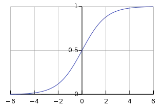

# Exploring Logistic Regression for Classification

## Introduction

Logistic regression is a classification algorithm used to assign observations to a discrete set of classes. Unlike linear regression which outputs continuous
number values, logistic regression transforms its output using the logistic sigmoid function to return a probability value which can then be mapped to two or
more discrete classes.

Logistic regression is used to calculate the probability of a binary event occurring and to deal with issues of classification. For example, predicting if an
incoming email is spam or not spam, or predicting if a credit card transaction is fraudulent or not fraudulent. In a medical context, logistic regression may be
used to predict whether a tumor is benign or malignant. In marketing, it may be used to predict if a given user (or group of users) will buy a certain product
or not. An online education company might use logistic regression to predict whether a student will complete their course on time or not.

## What are the different types of logistic regression?

The three types of logistic regression are:

-- Binary logistic regression is the statistical technique used to predict the relationship between the dependent variable (Y) and the independent variable (X),
where the dependent variable is binary in nature. For example, the output can be Success/Failure, 0/1 , True/False, or Yes/No. This is the type of logistic
regression that we’ve been focusing on in this post.

-- Multinomial logistic regression is used when you have one categorical dependent variable with two or more unordered levels (i.e two or more discrete
outcomes). It is very similar to logistic regression except that here you can have more than two possible outcomes. For example, let’s imagine that you want to
predict what will be the most-used transportation type in the year 2030. The transport type will be the dependent variable, with possible

-- outputs of train, bus, tram, and bike (for example). Ordinal logistic regression is used when the dependent variable (Y) is ordered (i.e., ordinal). The
dependent variable has a meaningful order and more than two categories or levels. Examples of such variables might be t-shirt size (XS/S/M/L/XL), answers on an
opinion poll (Agree/Disagree/Neutral), or scores on a test (Poor/Average/Good).

## Advantages of logistic regression

## Advantages

-   Logistic regression is easier to implement, interpret, and very efficient to train.
-   It makes no assumptions about distributions of classes in feature space.
-   It can easily extend to multiple classes(multinomial regression) and a natural probabilistic view of class predictions.
-   Logistic regression works well for cases where the dataset is linearly separable.

## Disadvantages

-   Logistic regression fails to predict a continuous outcome.
-   If the number of observations is lesser than the number of features, Logistic Regression should not be used, otherwise it may lead to overfitting.
-   Logistic Regression requires average or no multicollinearity between independent variables.
-   Logistic regression may not be accurate if the sample size is too small.

## What is Sigmoid Function

In order to map predicted values to probabilities, we use the sigmoid function. The function map any real input **_t_** and outputs a value between **_zero_**
and **_one_**. For the logit, this is interpreted as taking input log-odds and having output probability. the logistic “sigmoid” function is defined as follow:

To understand how sigmoid function squashes the values within the range, let’s visualize the graph of the sigmoid function.

 As you can see from the graph, the sigmoid function becomes asymptote to y=1 for positive values of x and becomes
asymptote to y=0 for negative values of x.

## Regularization in Logistic Regression

Regularization is extremely important in logistic regression modeling. Without regularization, the asymptotic nature of logistic regression would keep driving
loss towards 0 in high dimensions.

Regularization is the most used technique to penalize complex models in machine learning, it is deployed for reducing overfitting (or, contracting
generalization errors) by putting network weights small. It also enhances the performance of models for new inputs.

## Penalty Term

Through biasing data points towards specific values such as very small values to zero, regularization achieves this biasing by adding a tuning parameter to
strengthen those data points:

1. L1 regularization: It adds an L1 penalty that is equal to the absolute value of the magnitude of coefficient, or simply restricting the size of coefficients.
   For example, Lasso regression implements this method.
2. L2 Regularization: It adds an L2 penalty which is equal to the square of the magnitude of coefficients. For example, Ridge regression and SVM implement this
   method.
3. Elastic Net: When L1 and L2 regularization combine together, it becomes the elastic net method, it adds a hyperparameter.

If both L1 and L2 regularization work well, you might be wondering why we need both. It turns out they have different but equally useful properties, from a
practical standpoint, L1 tends to shrink coefficients to zero whereas L2 tends to shrink coefficients evenly.

L1 is therefore useful for feature selection, as we can drop any variables associated with coefficients that go to zero.

L2 on the other hand, is useful when you have collinear/codependent features.

(An example pair of codependent features is gender and ispregnant since, at the current level of medical technology, only females can be ispregnant.)
Codependence tends to increase coefficient variance, making coefficients unreliable/unstable, which hurts model generality. L2 reduces the variance of these
estimates, which counteracts the effect of codependencies.

## Conclusion

In this blog I presented the basic concept of logistic regression. I hope this blog was helpful and motivated you enough to get interested in the topic.

[For a Deeper Dive, Check the Original Post 🔗](https://akladyous.medium.com/logistic-regression-7885cebd3699)

Thank you for reading! ❤️
