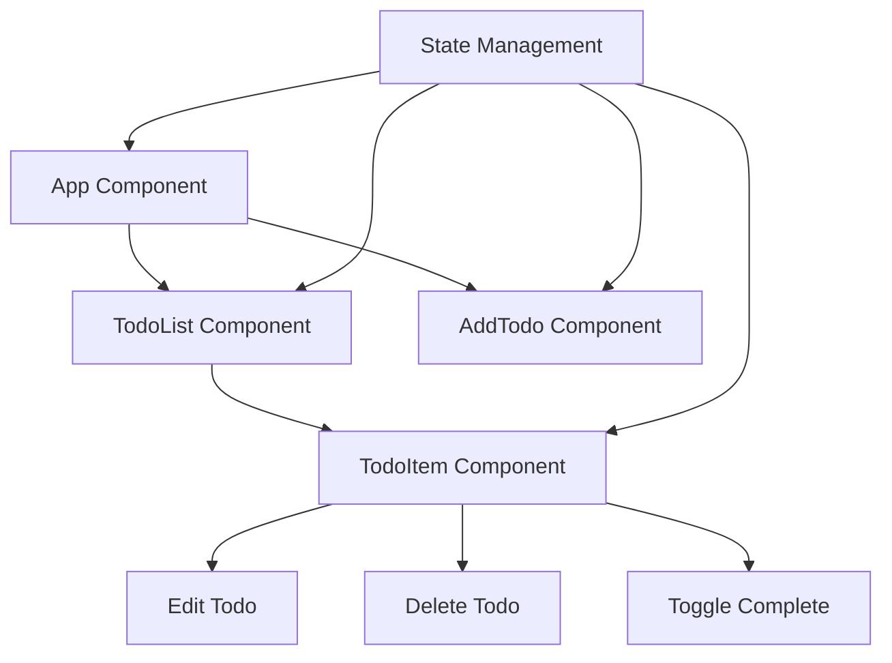

# SPA todo application workflow

-WorkFlow.webp)

Let’s explain how we'd build the same todo application as a Single Page Application (SPA) using React.js, focusing on data and state management. Let's start
with a high-level overview and then dive into the details.

First, let's visualize the structure of our React SPA todo app:



In this React SPA structure, we have a main App component that contains child components for different parts of our application. The key difference from the MPA
version is that all of these components exist within a single page, and React manages the rendering and updating of these components based on user interactions
and state changes.

Now, let's talk about data flow and state management in this React SPA:

1. **State Management**: In React, we typically keep the state at the highest necessary level and pass it down to child components as props. For a simple app,
   we might keep all state in the App component. For more complex apps, we might use a state management library like Redux or Recoil.
2. **Data Storage**: Unlike the MPA where data was primarily stored on the server, in an SPA we keep a copy of the data in the client-side state. We still
   persist data to a server via API calls, but the immediate source of truth for the UI is the client-side state.
3. **CRUD Operations**: These are typically handled by updating the client-side state and making asynchronous API calls to sync with the server.

Let's walk through a typical workflow:

1. Initial Load:
    - React app loads and mounts the App component
    - App component fetches todos from the server (e.g., via a REST API)
    - State is updated with the fetched todos, causing a re-render
2. Add Todo:
    - User inputs new todo in AddTodo component
    - On submit, state is updated with new todo
    - An API call is made to add the todo on the server
3. Edit Todo:
    - User clicks edit on a TodoItem
    - TodoItem switches to edit mode (managed by local state)
    - On save, parent state is updated and an API call is made
4. Delete Todo:
    - User clicks delete on a TodoItem
    - Todo is removed from state, causing an immediate UI update
    - An API call is made to delete the todo on the server
5. Toggle Complete:
    - User clicks to toggle todo status
    - State is immediately updated, reflecting the change in the UI
    - An API call is made to update the status on the server

Now, let's look at a simplified code example for our main App component:

```jsx
import React, { useState, useEffect } from "react";
import TodoList from "./TodoList";
import AddTodo from "./AddTodo";
import { fetchTodos, addTodo, updateTodo, deleteTodo } from "./api";

function App() {
    const [todos, setTodos] = useState([]);

    useEffect(() => {
        fetchTodos().then(setTodos);
    }, []);

    const handleAddTodo = (title) => {
        const newTodo = { id: Date.now(), title, completed: false };
        setTodos([...todos, newTodo]);
        addTodo(newTodo);
    };

    const handleToggle = (id) => {
        setTodos(todos.map((todo) => (todo.id === id ? { ...todo, completed: !todo.completed } : todo)));
        const todoToUpdate = todos.find((todo) => todo.id === id);
        updateTodo({ ...todoToUpdate, completed: !todoToUpdate.completed });
    };

    const handleDelete = (id) => {
        setTodos(todos.filter((todo) => todo.id !== id));
        deleteTodo(id);
    };

    return (
        <div>
            <h1>My Todos</h1>
            <AddTodo onAdd={handleAddTodo} />
            <TodoList todos={todos} onToggle={handleToggle} onDelete={handleDelete} />
        </div>
    );
}

export default App;
```

In this React example:

1. We use the `useState` hook to manage our todos state.
2. `useEffect` is used to fetch todos when the component mounts.
3. CRUD operations are handled by functions that update the state and make API calls.
4. The UI automatically updates when the state changes, thanks to React's reactivity.

The key differences from the MPA approach are:

1. **Single Page**: Everything happens within a single page load. React handles updating the UI.
2. **Client-Side State**: The immediate source of truth is the client-side state, not the server.
3. **Asynchronous Updates**: API calls happen asynchronously, allowing for immediate UI updates.
4. **Component Structure**: The UI is broken down into reusable components.

This approach provides a more fluid user experience, as most interactions don't require a full page reload. However, it also means we need to carefully manage
state and keep it in sync with the server.

Is this helpful in understanding the SPA approach? Would you like me to elaborate on any specific part of this workflow or dive deeper into how React manages
updates?
